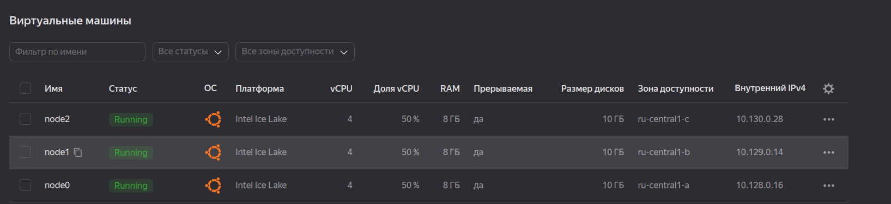
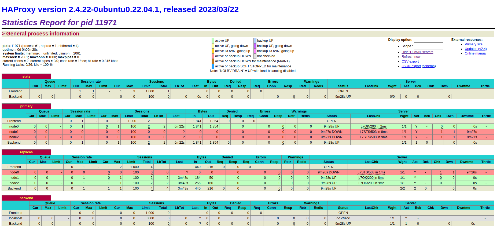
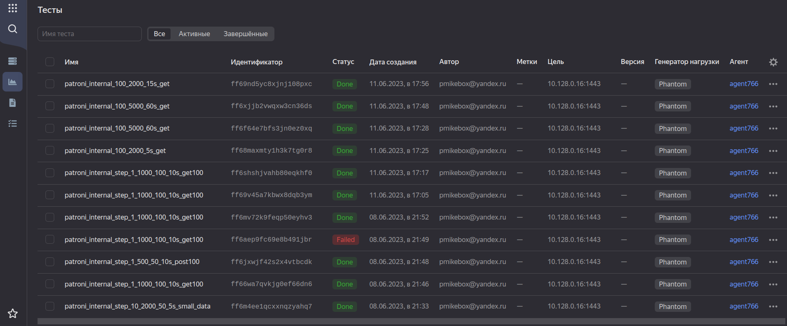
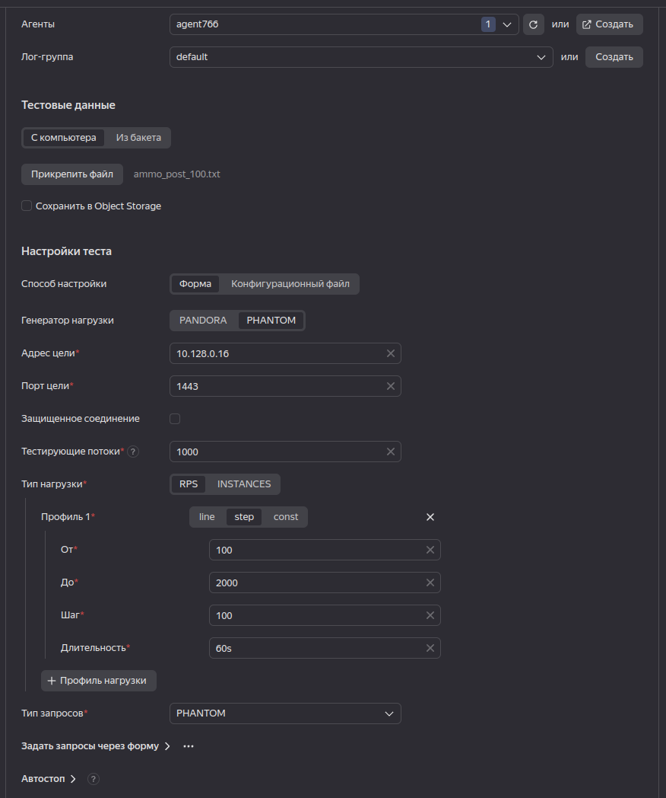
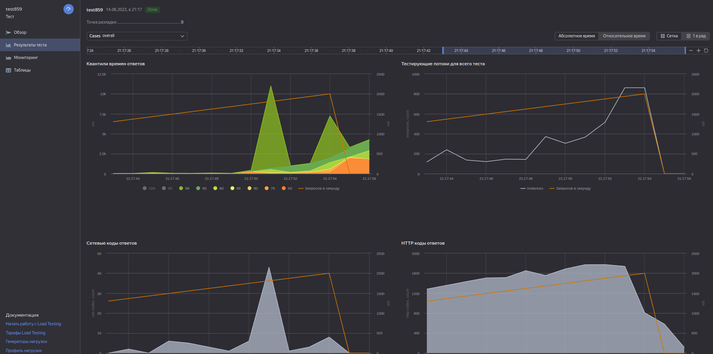
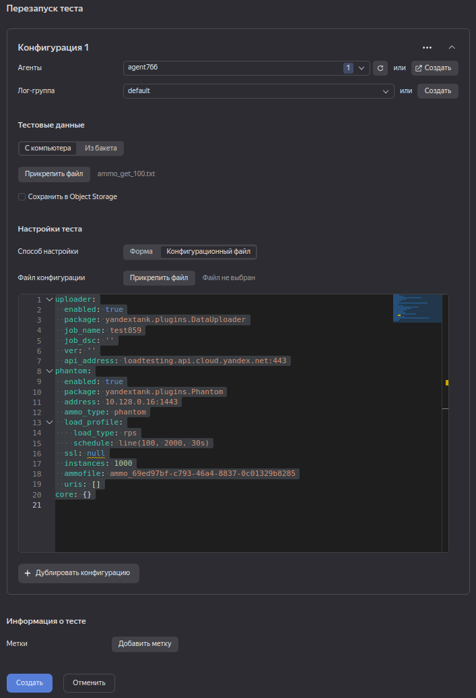
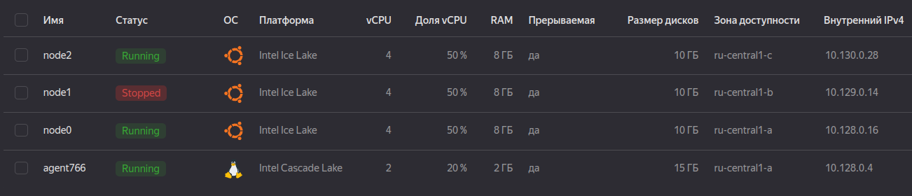
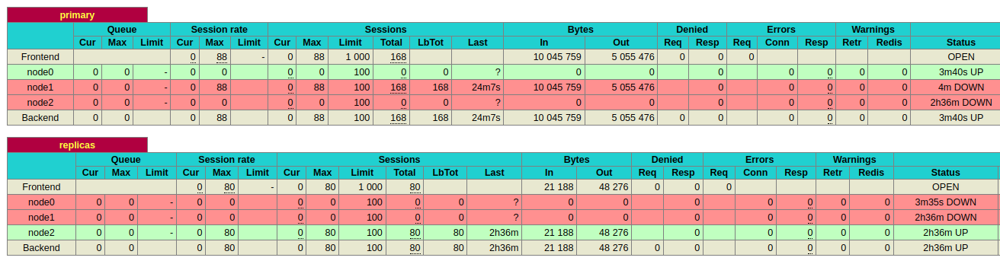

# «Создание и тестирование высоконагруженного отказоустойчивого кластера PostgreSQL на базе Patroni»

## 1. Инфраструктура.

Кластер будет развернут на базе инфраструктуры виртуальных машин Yandex Compute Cloud. Создано 3 ВМ в разных зонах доступности:
- ru-central1-a - node0.ru-central1.internal
- ru-central1-b - node1.ru-central1.internal
- ru-central1-c - node2.ru-central1.internal

VM: Ubuntu 22.04, SSD 10G Intel Ice Lake x 4, RAM: 8G, vCPU 50%, прерываемая



## 2. Установка основного ПО.

Установка ПО БД Postgresql, pgbouncer, patroni и DCS etcd на всех трех ВМ (node0, node1, node2)

```bash
apt update && apt install -y postgresql etcd patroni pgbouncer python3-etcd3
```

## 3. Настройка основного ПО.

### Etcd

настройки **etcd** прописываем в файле `/etc/default/etcd` на каждой ноде:
- node0@:[`/etc/default/etcd`](configs/etcd/etcd_node0.conf)
- node1@:[`/etc/default/etcd`](configs/etcd/etcd_node1.conf)
- node2@:[`/etc/default/etcd`](configs/etcd/etcd_node2.conf)

После настройки активируем и запустим сервис etcd на каждой ноде:
```bash
root@node0:/# systemctl enable --now etcd
root@node0:/# systemctl status etcd
● etcd.service - etcd - highly-available key value store
     Loaded: loaded (/lib/systemd/system/etcd.service; enabled; vendor preset: enabled)
     Active: active (running) since Tue 2023-06-13 14:26:43 UTC; 1h 49min ago
       Docs: https://etcd.io/docs
             man:etcd
   Main PID: 765 (etcd)
      Tasks: 10 (limit: 9401)
     Memory: 92.9M
        CPU: 1min 17.241s
     CGroup: /system.slice/etcd.service
             └─765 /usr/bin/etcd

Jun 13 15:02:45 node0 etcd[765]: found conflict at index 171328 [existing term: 686, conflicting term: 687]
Jun 13 15:02:45 node0 etcd[765]: truncate the unstable entries before index 171328
Jun 13 15:02:45 node0 etcd[765]: raft.node: b8afd733bb3d3f9e changed leader from b8afd733bb3d3f9e to 1364e27fe67dc19 at term 687
Jun 13 15:02:46 node0 etcd[765]: sync duration of 2.406261263s, expected less than 1s
Jun 13 15:02:49 node0 etcd[765]: sync duration of 2.251945808s, expected less than 1s
Jun 13 15:03:29 node0 etcd[765]: sync duration of 3.114650259s, expected less than 1s
Jun 13 15:03:31 node0 etcd[765]: sync duration of 2.018973841s, expected less than 1s
Jun 13 15:09:18 node0 etcd[765]: sync duration of 2.5521135s, expected less than 1s
Jun 13 15:55:38 node0 etcd[765]: sync duration of 2.028060899s, expected less than 1s
Jun 13 16:14:13 node0 etcd[765]: /health OK (status code 200)

```

Проверим состояние всего кластера `etcd`:
```bash
root@node0:/# etcdctl cluster-health
member 1364e27fe67dc19 is healthy: got healthy result from http://node2.ru-central1.internal:2379
member 8e134ad4a5efaca8 is healthy: got healthy result from http://node1.ru-central1.internal:2379
member b8afd733bb3d3f9e is healthy: got healthy result from http://node0.ru-central1.internal:2379
cluster is healthy
```

Кластер DCS ETCd запущен и готов к работе

### Postgresql

Настройка postgresql в данном случае полностью возлагается на patroni

### Patroni

настройки **patroni** прописываем в файле `/etc/patroni/config.yml` на каждой ноде:
- node0@:[`/etc/patroni/config.yml`](configs/patroni/patroni_node0.conf)
- node1@:[`/etc/patroni/config.yml`](configs/patroni/patroni_node1.conf)
- node2@:[`/etc/patroni/config.yml`](configs/patroni/patroni_node2.conf)

После настройки на первой ноде остановим сервис `postgresql` и удалим директорию `/var/lib/postgresql/14`, а затем запустим сервис `patroni` для инициализации кластера:
```bash
root@node0:/var/lib/postgresql# systemctl stop postgresql
root@node0:/var/lib/postgresql# rm -rf ./14
root@node0:/var/lib/postgresql# systemctl start patroni
root@node0:/var/lib/postgresql# systemctl status patroni
● patroni.service - High availability PostgreSQL Cluster
     Loaded: loaded (/etc/systemd/system/patroni.service; enabled; vendor preset: enabled)
     Active: active (running) since Tue 2023-06-13 16:45:36 UTC; 32min ago
   Main PID: 8972 (patroni)
      Tasks: 16 (limit: 9401)
     Memory: 166.4M
        CPU: 4.798s
     CGroup: /system.slice/patroni.service
             ├─ 8972 /usr/bin/python3 /usr/bin/patroni /etc/patroni/config.yml
             ├─ 9006 /usr/lib/postgresql/14/bin/postgres -D /var/lib/postgresql/14/main --config-file=/etc/postgresql/14/main/postgresql.conf --listen_addresses=127.0.0>
             ├─ 9008 "postgres: main: logger " "" "" "" "" "" "" "" "" "" "" "" "" "" "" "" "" "" "" "" "" "" "" "" "" "" "" "" "" "" "" "" "" "" "" "" "" "" "" "" "" ">
             ├─ 9010 "postgres: main: checkpointer " "" "" "" "" "" "" "" "" "" "" "" "" "" "" "" "" "" "" "" "" "" "" "" "" "" "" "" "" "" "" "" "" "" "" "" "" "" "" ">
             ├─ 9011 "postgres: main: background writer " "" "" "" "" "" "" "" "" "" "" "" "" "" "" "" "" "" "" "" "" "" "" "" "" "" "" "" "" "" "" "" "" "" "" "" "" "">
             ├─ 9012 "postgres: main: walwriter " "" "" "" "" "" "" "" "" "" "" "" "" "" "" "" "" "" "" "" "" "" "" "" "" "" "" "" "" "" "" "" "" "" "" "" "" "" "" "" ">
             ├─ 9013 "postgres: main: autovacuum launcher " "" "" "" "" "" "" "" "" "" "" "" "" "" "" "" "" "" "" "" "" "" "" "" "" "" "" "" "" "" "" "" "" "" "" "" "" >
             ├─ 9014 "postgres: main: stats collector " "" "" "" "" "" "" "" "" "" "" "" "" "" "" "" "" "" "" "" "" "" "" "" "" "" "" "" "" "" "" "" "" "" "" "" "" "" ">
             ├─ 9015 "postgres: main: logical replication launcher " "" "" "" "" "" "" "" "" "" "" "" "" "" "" "" "" "" "" "" "" "" "" "" "" "" "" "" "" "" "" "" "" "" >
             ├─ 9020 "postgres: main: postgres postgres 127.0.0.1(40980) idle" "" "" "" "" "" "" "" "" "" "" "" "" "" "" "" "" "" "" "" "" "" "" "" "" "" "" "" "" "" "">

Jun 13 16:46:01 node0 patroni[8972]: 2023-06-13 16:46:01,816 INFO: no action. I am (node0), the leader with the lock
```

Проверим `syslog`, [`patroni` отчитается об удачной инициализации и старте ](logs/patroni_init_node0.syslog)

Проверим статус кластера `patroni`:
```bash
root@node0:/var/lib/postgresql# sudo -u postgres patronictl -c /etc/patroni/config.yml list
+--------+-------------+--------+---------+----+-----------+
| Member | Host        | Role   | State   | TL | Lag in MB |
+ Cluster: main (7244212832745550623) ----+----+-----------+
| node0  | 10.128.0.16 | Leader | running |  1 |           |
+--------+-------------+--------+---------+----+-----------+
```

Кластер из одной (первой) ноды стартовал. Проделаем те же шаги на второй и третьей нодах. Результаты инициализации реплик в [`syslog` node1](logs/patroni_ini_node_1.syslog), [`syslog` node2](logs/patroni_ini_node_2.syslog). Реплики созданы, проверим статус кластера:
```bash
root@node0:/var/lib/postgresql# sudo -u postgres patronictl -c /etc/patroni/config.yml list
+--------+-------------+---------+---------+----+-----------+
| Member | Host        | Role    | State   | TL | Lag in MB |
+ Cluster: main (7244212832745550623) -----+----+-----------+
| node0  | 10.128.0.16 | Leader  | running |  1 |           |
| node1  | 10.129.0.14 | Replica | running |  1 |         0 |
| node2  | 10.130.0.28 | Replica | running |  1 |         0 |
+--------+-------------+---------+---------+----+-----------+
```
```bash
root@node0:/var/lib/postgresql# systemctl status patroni
● patroni.service - High availability PostgreSQL Cluster
     Loaded: loaded (/etc/systemd/system/patroni.service; enabled; vendor preset: enabled)
     Active: active (running) since Tue 2023-06-13 16:45:36 UTC; 35min ago
   Main PID: 8972 (patroni)
      Tasks: 16 (limit: 9401)
     Memory: 166.4M
        CPU: 5.069s
     CGroup: /system.slice/patroni.service
             ├─ 8972 /usr/bin/python3 /usr/bin/patroni /etc/patroni/config.yml
             ├─ 9006 /usr/lib/postgresql/14/bin/postgres -D /var/lib/postgresql/14/main --config-file=/etc/postgresql/14/main/postgresql.conf --listen_addresses=127.0.0>
             ├─ 9008 "postgres: main: logger " "" "" "" "" "" "" "" "" "" "" "" "" "" "" "" "" "" "" "" "" "" "" "" "" "" "" "" "" "" "" "" "" "" "" "" "" "" "" "" "" ">
             ├─ 9010 "postgres: main: checkpointer " "" "" "" "" "" "" "" "" "" "" "" "" "" "" "" "" "" "" "" "" "" "" "" "" "" "" "" "" "" "" "" "" "" "" "" "" "" "" ">
             ├─ 9011 "postgres: main: background writer " "" "" "" "" "" "" "" "" "" "" "" "" "" "" "" "" "" "" "" "" "" "" "" "" "" "" "" "" "" "" "" "" "" "" "" "" "">
             ├─ 9012 "postgres: main: walwriter " "" "" "" "" "" "" "" "" "" "" "" "" "" "" "" "" "" "" "" "" "" "" "" "" "" "" "" "" "" "" "" "" "" "" "" "" "" "" "" ">
             ├─ 9013 "postgres: main: autovacuum launcher " "" "" "" "" "" "" "" "" "" "" "" "" "" "" "" "" "" "" "" "" "" "" "" "" "" "" "" "" "" "" "" "" "" "" "" "" >
             ├─ 9014 "postgres: main: stats collector " "" "" "" "" "" "" "" "" "" "" "" "" "" "" "" "" "" "" "" "" "" "" "" "" "" "" "" "" "" "" "" "" "" "" "" "" "" ">
             ├─ 9015 "postgres: main: logical replication launcher " "" "" "" "" "" "" "" "" "" "" "" "" "" "" "" "" "" "" "" "" "" "" "" "" "" "" "" "" "" "" "" "" "" >
             ├─ 9020 "postgres: main: postgres postgres 127.0.0.1(40980) idle" "" "" "" "" "" "" "" "" "" "" "" "" "" "" "" "" "" "" "" "" "" "" "" "" "" "" "" "" "" "">
             ├─10245 "postgres: main: walsender replicator 10.129.0.14(49862) streaming 0/5000148" "" "" "" "" "" "" "" "" "" "" "" "" "" "" "" "" "" "" "" "" "" "" "" >
             └─10467 "postgres: main: walsender replicator 10.130.0.28(58360) streaming 0/5000148" "" "" "" "" "" "" "" "" "" "" "" "" "" "" "" "" "" "" "" "" "" "" "" >

Jun 13 17:19:31 node0 patroni[8972]: 2023-06-13 17:19:31,813 INFO: no action. I am (node0), the leader with the lock
---------------------------
root@node1:/var/log# systemctl status patroni
● patroni.service - High availability PostgreSQL Cluster
     Loaded: loaded (/etc/systemd/system/patroni.service; enabled; vendor preset: enabled)
     Active: active (running) since Tue 2023-06-13 17:08:35 UTC; 13min ago
   Main PID: 7020 (patroni)
      Tasks: 13 (limit: 9401)
     Memory: 145.1M
        CPU: 2.487s
     CGroup: /system.slice/patroni.service
             ├─7020 /usr/bin/python3 /usr/bin/patroni /etc/patroni/config.yml
             ├─7035 /usr/lib/postgresql/14/bin/postgres -D /var/lib/postgresql/14/main --config-file=/etc/postgresql/14/main/postgresql.conf --listen_addresses=127.0.0.>
             ├─7037 "postgres: main: logger " "" "" "" "" "" "" "" "" "" "" "" "" "" "" "" "" "" "" "" "" "" "" "" "" "" "" "" "" "" "" "" "" "" "" "" "" "" "" "" "" "">
             ├─7038 "postgres: main: startup recovering 000000010000000000000005" "" "" "" "" "" "" "" "" "" "" "" "" "" "" "" "" "" "" "" "" "" "" "" "" "" "" "" "" "">
             ├─7039 "postgres: main: checkpointer " "" "" "" "" "" "" "" "" "" "" "" "" "" "" "" "" "" "" "" "" "" "" "" "" "" "" "" "" "" "" "" "" "" "" "" "" "" "" "">
             ├─7040 "postgres: main: background writer " "" "" "" "" "" "" "" "" "" "" "" "" "" "" "" "" "" "" "" "" "" "" "" "" "" "" "" "" "" "" "" "" "" "" "" "" "" >
             ├─7041 "postgres: main: stats collector " "" "" "" "" "" "" "" "" "" "" "" "" "" "" "" "" "" "" "" "" "" "" "" "" "" "" "" "" "" "" "" "" "" "" "" "" "" "">
             ├─7042 "postgres: main: walreceiver streaming 0/5000148" "" "" "" "" "" "" "" "" "" "" "" "" "" "" "" "" "" "" "" "" "" "" "" "" "" "" "" "" "" "" "" "" "">
             └─7044 "postgres: main: postgres postgres 127.0.0.1(35342) idle" "" "" "" "" "" "" "" "" "" "" "" "" "" "" "" "" "" "" "" "" "" "" "" "" "" "" "" "" "" "" >

Jun 13 17:20:31 node1 patroni[7020]: 2023-06-13 17:20:31,839 INFO: no action. I am (node1), a secondary, and following a leader (node0)

--------------------------------------------
root@node2:/var/lib/postgresql# systemctl status patroni
● patroni.service - High availability PostgreSQL Cluster
     Loaded: loaded (/etc/systemd/system/patroni.service; enabled; vendor preset: enabled)
     Active: active (running) since Tue 2023-06-13 17:13:10 UTC; 10min ago
   Main PID: 6129 (patroni)
      Tasks: 13 (limit: 9401)
     Memory: 111.6M
        CPU: 2.288s
     CGroup: /system.slice/patroni.service
             ├─6129 /usr/bin/python3 /usr/bin/patroni /etc/patroni/config.yml
             ├─6144 /usr/lib/postgresql/14/bin/postgres -D /var/lib/postgresql/14/main --config-file=/etc/postgresql/14/main/postgresql.conf --listen_addresses=127.0.0.>
             ├─6146 "postgres: main: logger " "" "" "" "" "" "" "" "" "" "" "" "" "" "" "" "" "" "" "" "" "" "" "" "" "" "" "" "" "" "" "" "" "" "" "" "" "" "" "" "" "">
             ├─6147 "postgres: main: startup recovering 000000010000000000000005" "" "" "" "" "" "" "" "" "" "" "" "" "" "" "" "" "" "" "" "" "" "" "" "" "" "" "" "" "">
             ├─6148 "postgres: main: checkpointer " "" "" "" "" "" "" "" "" "" "" "" "" "" "" "" "" "" "" "" "" "" "" "" "" "" "" "" "" "" "" "" "" "" "" "" "" "" "" "">
             ├─6149 "postgres: main: background writer " "" "" "" "" "" "" "" "" "" "" "" "" "" "" "" "" "" "" "" "" "" "" "" "" "" "" "" "" "" "" "" "" "" "" "" "" "" >
             ├─6150 "postgres: main: stats collector " "" "" "" "" "" "" "" "" "" "" "" "" "" "" "" "" "" "" "" "" "" "" "" "" "" "" "" "" "" "" "" "" "" "" "" "" "" "">
             ├─6151 "postgres: main: walreceiver streaming 0/5000148" "" "" "" "" "" "" "" "" "" "" "" "" "" "" "" "" "" "" "" "" "" "" "" "" "" "" "" "" "" "" "" "" "">
             └─6157 "postgres: main: postgres postgres 127.0.0.1(40242) idle" "" "" "" "" "" "" "" "" "" "" "" "" "" "" "" "" "" "" "" "" "" "" "" "" "" "" "" "" "" "" >

Jun 13 17:21:41 node2 patroni[6129]: 2023-06-13 17:21:41,821 INFO: no action. I am (node2), a secondary, and following a leader (node0)
```

Все три ноды кластера `patroni` введены в строй и запущены.


### Pgbouncer

настройки **pgbouncer** прописываем в файле `/etc/pgbouncer/pgbouncer.ini` на каждой ноде:
- node0@:[`/etc/pgbouncer/pgbouncer.ini`](configs/pgbouncer/pgbouncer_node0.conf)
- node1@:[`/etc/pgbouncer/pgbouncer.ini`](configs/pgbouncer/pgbouncer_node1.conf)
- node2@:[`/etc/pgbouncer/pgbouncer.ini`](configs/pgbouncer/pgbouncer_node2.conf)

а также прописываем пользователей для подключения к БД в файле `/etc/pgbouncer/userlist.txt`
- [node0,node1, node2]@:[`/etc/pgbouncer/userlist.txt`](configs/pgbouncer/userlist.txt)

После настройки активируем и запустим сервисы `pgbouncer` на каждой ноде:
```bash
root@node0:/var/lib/postgresql# systemctl enable --now pgbouncer
● pgbouncer.service - LSB: start pgbouncer
     Loaded: loaded (/etc/init.d/pgbouncer; generated)
     Active: active (running) since Tue 2023-06-13 17:25:10 UTC; 1s ago
       Docs: man:systemd-sysv-generator(8)
    Process: 11078 ExecStart=/etc/init.d/pgbouncer start (code=exited, status=0/SUCCESS)
      Tasks: 2 (limit: 9401)
     Memory: 1.7M
        CPU: 11ms
     CGroup: /system.slice/pgbouncer.service
             └─11084 /usr/sbin/pgbouncer -d /etc/pgbouncer/pgbouncer.ini

Jun 13 17:25:10 node0 systemd[1]: Starting LSB: start pgbouncer...
Jun 13 17:25:10 node0 pgbouncer[11078]:  * Starting PgBouncer pgbouncer
Jun 13 17:25:10 node0 pgbouncer[11078]:    ...done.
Jun 13 17:25:10 node0 systemd[1]: Started LSB: start pgbouncer.
```

и проверим работоспособность сервиса:

```bash
root@node0:/var/lib/postgresql# sudo -u postgres psql -h node0 -p 6432
Password for user postgres:
psql (14.8 (Ubuntu 14.8-0ubuntu0.22.04.1))
Type "help" for help.

postgres=# \l
                                  List of databases
   Name    |  Owner   | Encoding |   Collate   |    Ctype    |   Access privileges
-----------+----------+----------+-------------+-------------+-----------------------
 postgres  | postgres | UTF8     | en_US.UTF-8 | en_US.UTF-8 |
 template0 | postgres | UTF8     | en_US.UTF-8 | en_US.UTF-8 | =c/postgres          +
           |          |          |             |             | postgres=CTc/postgres
 template1 | postgres | UTF8     | en_US.UTF-8 | en_US.UTF-8 | =c/postgres          +
           |          |          |             |             | postgres=CTc/postgres
(3 rows)

```

Кластер `HA Postgresql patroni` запущен и готов принимать соединения.


## 4. Установка и настройка ПО балансировщика


```bash
apt update && apt install -y haproxy
```

### HAProxy

В данной реализации будем использовать упрощенную схему и разместим балансировщик только на одной ноде - `node0`. В идеале, балансировщик лучше установить на каждую ноду как на этой схеме:


настройки **haproxy** прописываем в файле `/etc/haproxy/haproxy.cfg`:
- node0@:[`/etc/haproxy/haproxy.cfg`](configs/haproxy/haproxy.conf)

Активируем и запустим сервис:
```bash
root@node0:/etc/haproxy# systemctl enable --now haproxy
● haproxy.service - HAProxy Load Balancer
     Loaded: loaded (/lib/systemd/system/haproxy.service; enabled; vendor preset: enabled)
     Active: active (running) since Tue 2023-06-13 17:42:02 UTC; 8s ago
       Docs: man:haproxy(1)
             file:/usr/share/doc/haproxy/configuration.txt.gz
    Process: 11967 ExecStartPre=/usr/sbin/haproxy -Ws -f $CONFIG -c -q $EXTRAOPTS (code=exited, status=0/SUCCESS)
   Main PID: 11969 (haproxy)
      Tasks: 5 (limit: 9401)
     Memory: 4.4M
        CPU: 25ms
     CGroup: /system.slice/haproxy.service
             ├─11969 /usr/sbin/haproxy -Ws -f /etc/haproxy/haproxy.cfg -p /run/haproxy.pid -S /run/haproxy-master.sock
             └─11971 /usr/sbin/haproxy -Ws -f /etc/haproxy/haproxy.cfg -p /run/haproxy.pid -S /run/haproxy-master.sock

Jun 13 17:42:02 node0 systemd[1]: Starting HAProxy Load Balancer...
Jun 13 17:42:02 node0 haproxy[11969]: [NOTICE]   (11969) : New worker #1 (11971) forked
Jun 13 17:42:02 node0 systemd[1]: Started HAProxy Load Balancer.
Jun 13 17:42:03 node0 haproxy[11971]: [WARNING]  (11971) : Server primary/node1 is DOWN, reason: Layer7 wrong status, code: 503, info: "Service Unavailable", check dura>
Jun 13 17:42:03 node0 haproxy[11971]: [WARNING]  (11971) : Server primary/node2 is DOWN, reason: Layer7 wrong status, code: 503, info: "Service Unavailable", check dura>
Jun 13 17:42:04 node0 haproxy[11971]: [WARNING]  (11971) : Server replicas/node0 is DOWN, reason: Layer7 wrong status, code: 503, info: "Service Unavailable", check dur>
lines 1-20/20 (END)

```

Проверим соединения на мастер и на реплики:
```postgresql
root@node0:/etc/haproxy# sudo -u postgres psql -h localhost -p 5000
Password for user postgres:
psql (14.8 (Ubuntu 14.8-0ubuntu0.22.04.1))
Type "help" for help.

postgres=# \l
                                  List of databases
   Name    |  Owner   | Encoding |   Collate   |    Ctype    |   Access privileges
-----------+----------+----------+-------------+-------------+-----------------------
 postgres  | postgres | UTF8     | en_US.UTF-8 | en_US.UTF-8 |
 template0 | postgres | UTF8     | en_US.UTF-8 | en_US.UTF-8 | =c/postgres          +
           |          |          |             |             | postgres=CTc/postgres
 template1 | postgres | UTF8     | en_US.UTF-8 | en_US.UTF-8 | =c/postgres          +
           |          |          |             |             | postgres=CTc/postgres
(3 rows)
                         ^
postgres=# create table test();
CREATE TABLE
postgres=# \dt
        List of relations
 Schema | Name | Type  |  Owner
--------+------+-------+----------
 public | test | table | postgres
(1 row)

postgres=#

-------------------------------------------------------------

root@node0:/etc/haproxy# sudo -u postgres psql -h localhost -p 5001
Password for user postgres:
psql (14.8 (Ubuntu 14.8-0ubuntu0.22.04.1))
Type "help" for help.
postgres=# \dt
        List of relations
 Schema | Name | Type  |  Owner
--------+------+-------+----------
 public | test | table | postgres
(1 row)

postgres=# create table test_1();
ERROR:  cannot execute CREATE TABLE in a read-only transaction
postgres=#


```

Попытка создания таблицы на реплике не увенчалась успехом, что и следовало ожидать. Также видно, что созданная таблица на мастере синхронизировалась на реплики.

### Статистика

Также, на порту 7000 балансировщика можно просмотреть статистику и состояние нод кластера:


Вкладка **primary** отражает состояние мастер-ноды - зеленым лидер(мастер) кластера, красным - реплики
Вкладка **replicas** отражает состояние реплик-нод - зеленым реплики кластера, красным - лидер(мастер).

Данные берутся от `restAPI сервера patroni`


## 5. Установка и настройка бэкенда.

Для нагрузочного тестирования кластера посредством Yandex.Tank создадим небольшой бэкенд на базе fastAPI, для отправки и чтения данных по протоколу `http` по технологии `restAPI`, наподобии реализованного функционала в `patroni`.

Код бэкенда расположен на `github`: [https://github.com/pmshoot/otus-patroni-backend](https://github.com/pmshoot/otus-patroni-backend).

Бэкенд:
- обрабатывает соединения и запросы http
- запросы на чтение (методы get, head, options) делает запрос к кластеру БД на порт 5001
- запросы на запись (методы post, put, patch) делает запрос к кластеру БД на порта 5000
- в ответ отсылает json с данными

## 6. Генерация данных (патронов) для Yandex.Tank

Для генерации данных для нагрузочного теста воспользуемся соответствующей документацией к Yandex.Tank: [https://yandextank.readthedocs.io/en/latest/ammo_generators.html](https://yandextank.readthedocs.io/en/latest/ammo_generators.html). Код генератора данных: [https://github.com/pmshoot/otus-patroni-backend/tree/main/ytank](https://github.com/pmshoot/otus-patroni-backend/tree/main/ytank)

Снеренируем файлы с данными для `GET` и `POST` запросов:
```bash
python ammogen.py > ammo_get_100.txt
python ammogen.py > ammo_post_100.txt
```
- [файл с "патронами" для `GET` запросов](backend/ytank_ammo/ammo_get_100.txt)
- [файл с "патронами" для `POST` запросов](backend/ytank_ammo/ammo_post_100.txt)

## 7. Создание тестов

Для проведения нагрузочных тестов создадим Load Testing Agent. Для этого из предлагаемого списка сервисов `YC` выберем сервис `Load Testing` создадим агента.

[pic: содание агента для тестирования](pics/test_agent_create.png)

Заполним обязательные поля со звездочкой ( я выбрал минимальную конфигурацию) и нажмем кнопку `Создать. После создания агента  в списках ВМ у нас появится еще одна машина с заданным именем агента:

[pic: список виртуальных машин](pics/yandex_cloud_vms_all.png)

Запустим ВМ с агентом. Затем в списке наших сервисов пройдем в раздел `Load Testing` и слева на панели нажмем кнопку `Тесты`



Создадим тест, нажав на кнопку в верхнем правом углу.



- выбираем созданного агента(-ов, можно выбрать несколько)
- лог-группу для дальнейшего мониторинга
- файл с "патронами", загрузив с диска или создав бакет и поместив файлы туда (удобнее при повторных тестах)
- выбираем способ настройки теста - форма (вводим здесь на странице) или заранее подготовленный файл
- генератор нагрузки - в нашем случае `PHANTOM`
- адрес и порт цели - адрес нашего бэкенда
- тестирующие потоки - указываем сколько соединений будет пытаться создать агент на наш бэкенд
- тип нагрузки - `RPS` (запросов в секунду)
- создаем профиль(и, можно несколько) - выбираем тип
   - `line` (постепенное увеличение нагрузки от min до max за указанное время)
   - `step` (постепенное увеличение нагрузки от min до max с шагом step за указанное время)
   - `const` (фиксированное кол-во запросов в сек за указанное время)
- тип запросов - `PHANTOM`
- желательно включить мониторинг агента для лпределения нагрузки на сервер.
- добавляем имя теста, описание по желанию и жмем создать.

Запусе теста произойдет автоматически сразу после создания теста. На вкладках `Результаты теста` и `Мониторинг` можно наблюдать за процессом и результатами.



После проведения, тест можно перезапустить, с изменением настроек. Для этого на странице теста в правом верхнем углу жмем `Перезапустить`.



- выбираем лог-группу
- подгружаем/выбираем файл с "патронами"
- настройки сожно править в конфигурационоом файле от предыдущего теста или ввести новые настройки в форме
- Создать - повторяем процесс

Все проведенные тесты сохраняются с возможностью анализа и повтора.

Таким образом можно создать многочисленные и сложные наборы тестов для под разные нагрузки.

## 8. Воспроизведение сбоя.

Воспроизведем сбой одной из ноды, например мастер-ноды, и убедимся, что кластер продолжит работу. Выясним мастера:
```bash
dba@node0:~$ patronictl list
+--------+-------------+---------+---------+----+-----------+
| Member | Host        | Role    | State   | TL | Lag in MB |
+ Cluster: main (7244212832745550623) -----+----+-----------+
| node0  | 10.128.0.16 | Replica | running |  2 |         0 |
| node1  | 10.129.0.14 | Leader  | running |  2 |           |
| node2  | 10.130.0.28 | Replica | running |  2 |         0 |
+--------+-------------+---------+---------+----+-----------+
```

Лидером является `node1`. Воспроизведем сбой - остановим ноду.



```bash
+--------+-------------+---------+---------+----+-----------+
| Member | Host        | Role    | State   | TL | Lag in MB |
+ Cluster: main (7244212832745550623) -----+----+-----------+
| node0  | 10.128.0.16 | Leader  | running |  2 |           |
| node1  | 10.129.0.14 | Replica | stopped |    |   unknown |
| node2  | 10.130.0.28 | Replica | running |  2 |         0 |
+--------+-------------+---------+---------+----+-----------+
dba@node0:~$ patronictl list
+--------+-------------+---------+---------+----+-----------+
| Member | Host        | Role    | State   | TL | Lag in MB |
+ Cluster: main (7244212832745550623) -----+----+-----------+
| node0  | 10.128.0.16 | Leader  | running |  3 |           |
| node2  | 10.130.0.28 | Replica | running |  2 |         0 |
+--------+-------------+---------+---------+----+-----------+
dba@node0:~$

```
Статус `node1` сначала поменялся на `stopped`, а затем нода и вовсе исчезла из списка. Лидером стала `node0`. Тоже показывает и `haproxy stats`



`node1` нет ни в списке `primary` ни в `replicas`

Стартуем `node1`. Со временем машина появляется в строю и занимает место реплики.

```bash
dba@node0:~$ patronictl list
+--------+-------------+---------+---------+----+-----------+
| Member | Host        | Role    | State   | TL | Lag in MB |
+ Cluster: main (7244212832745550623) -----+----+-----------+
| node0  | 10.128.0.16 | Leader  | running |  3 |           |
| node1  | 10.129.0.14 | Replica | running |    |   unknown |
| node2  | 10.130.0.28 | Replica | running |  3 |         0 |
+--------+-------------+---------+---------+----+-----------+
dba@node0:~$ patronictl list
+--------+-------------+---------+---------+----+-----------+
| Member | Host        | Role    | State   | TL | Lag in MB |
+ Cluster: main (7244212832745550623) -----+----+-----------+
| node0  | 10.128.0.16 | Leader  | running |  3 |           |
| node1  | 10.129.0.14 | Replica | stopped |    |   unknown |
| node2  | 10.130.0.28 | Replica | running |  3 |         0 |
+--------+-------------+---------+---------+----+-----------+
dba@node0:~$ patronictl list
+--------+-------------+---------+---------+----+-----------+
| Member | Host        | Role    | State   | TL | Lag in MB |
+ Cluster: main (7244212832745550623) -----+----+-----------+
| node0  | 10.128.0.16 | Leader  | running |  3 |           |
| node1  | 10.129.0.14 | Replica | running |  3 |         0 |
| node2  | 10.130.0.28 | Replica | running |  3 |         0 |
+--------+-------------+---------+---------+----+-----------+
```
Лог `patroni` повествует, что `node1` стала репликой и была произведена начитка недостающих данных WAL с мастера

```log
Jun 14 16:53:46 node1 patroni[771]: 2023-06-14 16:53:46,743 INFO: Lock owner: node0; I am node1
Jun 14 16:53:46 node1 patroni[771]: 2023-06-14 16:53:46,758 INFO: running pg_rewind from node0 in progress
Jun 14 16:53:54 node1 patroni[771]: 2023-06-14 16:53:54,301 INFO: pg_rewind exit code=0
Jun 14 16:53:54 node1 patroni[771]: 2023-06-14 16:53:54,302 INFO:  stdout=
Jun 14 16:53:54 node1 patroni[771]: 2023-06-14 16:53:54,302 INFO:  stderr=pg_rewind: servers diverged at WAL location 0/5BB9038 on timeline 2
Jun 14 16:53:54 node1 patroni[771]: pg_rewind: rewinding from last common checkpoint at 0/5BB8FC0 on timeline 2
Jun 14 16:53:54 node1 patroni[771]: pg_rewind: Done!
```

Кластер благополучно пережил сбой ведущей ноды, повысив в статусе одну из реплик и вернув в строй вернувшуюся позже отставшую ноду. В случае, если за период отсутсвтия в строю одной из нод пройдет достаточно времени, чтобы данные WAL файлов перезатерлись, `patroni` не сможет накатить недостающие данные. Для этого случая нужно остановить сервис `patroni`, удалить директорию БД с данными и запустить `patroni` с последующей инициализацией БД и загрузки данных с мастера.
